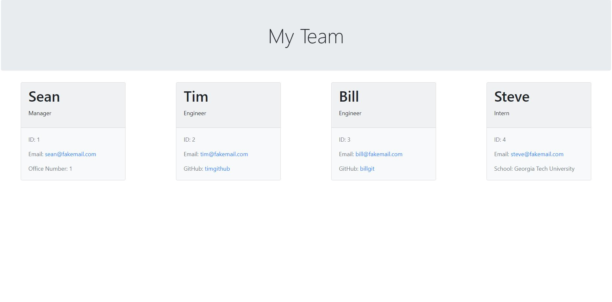

# team-profile-generator

## Description

The motivation of this project is to build a node.js command-line application that takes in information about employees and generates an HTML webpage that displays information for each person. The focus of this project is to use object oriented programming techniques such as classes and constructors to build reusable objects. The application is powered by node.js and npm to organize the packages/applications the project depends on. The inquirer package is used to prompt and store user inputs, which are then used to create new class instances. The information collected is then compiled into an HTML file to display the team. The application features TDD (Test Driven Development) concepts and implements Jest to perform unit testing for each class.

## Installation

The following tools were used for the development and testing of this project. Web Browser (Google Chrome preferred) Code development IDE (Microsoft VS Code) node.js (JavaScript runtime environment) npm (software registry containing inquirer).

## Usage

Open command line interface and run node commands to initiate the command-line application. Open HTML using Code development IDE. 

## Credits

Georgia Tech Coding Bootcamp instructors, TA's, and other faculty.

## License

Not applicable

## Tests
Run test using "npm run test" command which will initialize Jest tests.